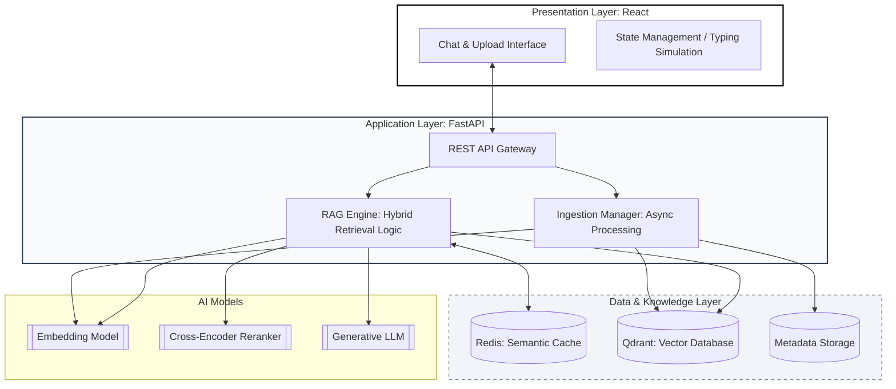
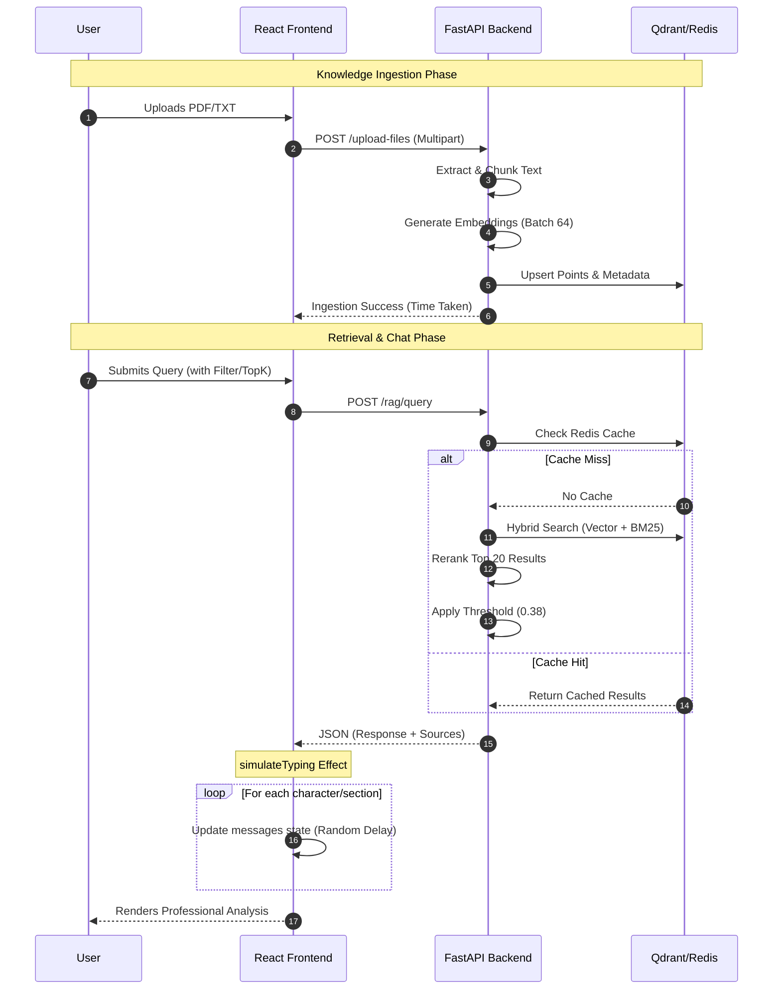

# RAG Backend System (FastAPI + Qdrant + Redis)

A high-performance **Retrieval-Augmented Generation (RAG)** backend built with FastAPI.

---

## Overview

This project is an advanced Retrieval-Augmented Generation (RAG) system that enables users to:

- Upload documents (PDF, DOCX, TXT, code)
- Perform intelligent semantic + keyword search
- Generate structured answers using LLMs
- Filter results by specific documents
- Optimize performance with multi-layer caching

It combines vector search, keyword retrieval, and reranking to produce highly relevant answers.

---

## Key Features

- Hybrid Retrieval (Vector + BM25)
- Cross-Encoder Reranking
- Multi-level Caching (Redis + Retrieval)
- File-level Filtering
- Parallel File Ingestion
- Semantic Chunking
- Structured LLM Output

---

## Why This Project

Traditional search systems fail to understand semantic meaning and context.  
This project solves that by combining:

- Dense vector search (semantic understanding)
- Sparse keyword search (exact matching)
- Cross-encoder reranking (precision)
- Caching (performance)

**Result:** Faster and more accurate responses over large document collections.

---

## Performance

- File ingestion (1000+ chunks): ~1.3 minutes  
- 8 files ingestion: ~8 minutes (parallel processing)  
- Redis cache hit: ~instant response  
- Hybrid retrieval optimized for low latency  

## End-to-End System Flow

```mermaid
graph TD
    %% Entry
    Input((User Query)) --> PreProc[Query Normalization & Cleaning]
    
    %% Semantic Layer
    PreProc --> Cache{Semantic Cache Check}
    Cache -- Hit --> Format[Format JSON Response]
    
    %% Retrieval Layer
    Cache -- Miss --> VectorGen[Vector Embedding Generation]
    VectorGen --> ParallelSearch[Parallel Multi-Collection Retrieval]
    ParallelSearch --> Dedup[Neural & Keyword Deduplication]
    
    %% Scoring Strategy
    subgraph Hybrid_Scoring_Engine [Hybrid Ranking Engine]
        Dedup --> InitialRank[Initial Rank: Neural 0.4 / Keyword 0.6]
        InitialRank --> Selection[Top-K Candidate Selection]
        Selection --> CrossRank[Cross-Encoder Neural Reranking]
        CrossRank --> FinalWeight[Final Weighted Merge: 0.7 / 0.2 / 0.1]
    end
    
    %% Quality Control
    FinalWeight --> RelGate{Relevance Threshold Gate}
    RelGate -- Rejected --> NullState[Generate 'Information Not Found']
    RelGate -- Approved --> ContextSynth[LLM Contextual Synthesis]
    
    %% Exit
    ContextSynth --> UpdateCache[Update Semantic Cache]
    NullState --> UpdateCache
    UpdateCache --> Output((Final Professional Analysis))

    style Cache fill:#000000,stroke:#64748b,stroke-width:2px
    style RelGate fill:#f0fdf4,stroke:#16a34a,stroke-width:2px
    style Hybrid_Scoring_Engine fill:#f1f5f9,stroke:#475569,stroke-dasharray: 5 5
```



This diagram represents the complete request lifecycle from user interaction to final response generation.

## Architecture Diagram



---

## User Flow Diagram



---

## Tech Stack

- FastAPI
- Qdrant
- Redis
- Sentence Transformers
- Cross Encoder
- Groq API
- PyMuPDF
- python-docx
- NLTK

---

## Project Structure

```
.
├── main.py
├── routes/
├── services/
├── core/
├── db/
├── utils/
```

---

## File Upload Flow

1. Upload files via `/files/upload-files`
2. Extract text
3. Clean and preprocess
4. Chunk text
5. Generate embeddings
6. Store in Qdrant
7. Store metadata

---

## Retrieval Pipeline

- Vector Search
- BM25 Search
- Hybrid Merge
- Cross Encoder Reranking
- Threshold Filtering

---

## Caching Strategy

- Embedding Cache
- Retrieval Cache
- Response Cache

---

## LLM Processing

Generates structured JSON output:

```json
[
  {
    "doc_id": 1,
    "title": "Title",
    "content": "Explanation"
  }
]
```

---

## API Endpoints

### POST /rag/query

```json
{
  "query": "What is AI?",
  "filter_keyword": "optional",
  "top_k": 7
}
```

### Response 

```json
{
    "query": "What causes the great war ?",
    "responses": [
        {
            "title": "The Role of Leadership in the Great War",
            "content": "The success of a leader in the Great War was largely dependent on their ability to connect with the common man. ",
            "source": "HistoryOfTheGreatWar1914_1918.pdf",
            "score": "95%"
        }
    ],
    "metadata": {
        "status": "success",
        "filter_applied": "Global",
        "global_sources": "filename - score",
        "top_k_used": 7
    }
}
```

### POST /files/upload-files
Upload multiple documents and ingest into vector database.

### GET /files/list-files
Retrieve list of uploaded documents.

---

## How to Run

```bash
pip install -r requirements.txt
uvicorn main:app --reload
```

---

## Environment Variables

```
QDRANT_URL=
QDRANT_API_KEY=
REDIS_HOST=
REDIS_PORT=
REDIS_DB=
GROQ_API_KEY=
EMBEDDING_MODEL=
LLM_MODEL=
RERANKING_CROSS_ENCODER=
```

---

## Features

- Multi-document retrieval
- File filtering
- Hybrid search
- Reranking
- Redis caching
- Parallel ingestion
- LLM Title and content rephrasing

---

# Frontend (React + Tailwind CSS)

A modern, responsive UI for interacting with the RAG backend.

---

## Frontend User Flow

## Tech Stack (Frontend)

- React (Vite)
- Tailwind CSS
- Axios
- Lucide Icons

---

## Frontend Structure

```
src/
├── components/
│   ├── Sidebar.jsx
│   ├── Navbar.jsx
│   ├── MessageList.jsx
│   ├── FileSelector.jsx
│   ├── TopKSettings.jsx
├── pages/
│   ├── ChatPage.jsx
│   ├── UploadPage.jsx
├── api/
│   ├── api.js
├── App.jsx
├── main.jsx
```

---

## Chat Features

- Real-time query input
- File-based filtering
- Adjustable Top-K retrieval
- Typing animation
- Relevance indicators

---

## Upload Features

- Multi-file upload
- Drag & drop UI
- Upload progress tracking
- Time measurement

---

## 🔌 API Integration

### Endpoints Used

- `POST /rag/query`
- `POST /files/upload-files`
- `GET /files/list-files`

---

## Run Frontend

```bash
npm install
npm run dev
```

---

## UI Highlights

- Clean minimal UI
- Fully responsive (mobile + desktop)
- Smooth animations
- No scrollbar UI (custom hidden scroll)

---